# SPlot

SPlot is Scala library for data visualization.

# Goals

- Provide simple API in Scala for data visualization similar to ggplot (http://ggplot2.org/) and Seaborn (https://seaborn.pydata.org/)
- Support exploratory data analysis

Currently project is **NOT** focused on:

- Performance
- Rich possibilities for customization

# Getting started

Import implicits, which adds methods to Scala collection enabling plotting:
```scala
import com.datawizards.splot.api.implicits._
```

# Basic example

To plot bar chart using Scala sequence you need to call one method:
```scala
import com.datawizards.splot.api.implicits._

Seq(1.0, 4.0, 9.0).plotBar()
```

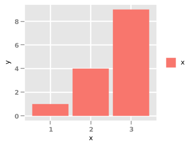

# Supported charts

- Bar
- Scatter
- Line
- Histogram

> Please note that all below examples **require** importing:

```scala
import com.datawizards.splot.api.implicits._
```

## Bar

### Bar chart for sequence of numbers

```scala
val data = Seq(1.0, 4.0, 9.0)
data.plotBar()
```

### Bar chart for sequence of case class

```scala
case class Person(name: String, age: Int)

val data = Seq(
    Person("p1", 20),
    Person("p2", 30),
    Person("p3", 40)
)

data.plotBar(_.age)
```

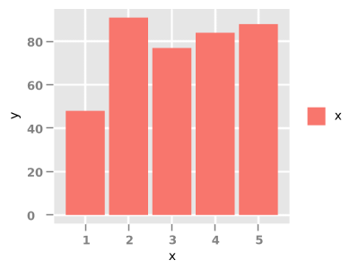

### Bar chart for categorical data

```scala
val populationByCountry = Seq(
    ("DE", 81),
    ("TR", 72),
    ("FR", 63),
    ("UK", 62),
    ("IT", 61),
    ("ES", 46),
    ("UA", 45),
    ("PL", 38),
    ("RO", 19),
    ("NL", 17),
    ("GR", 11),
    ("PT", 11),
    ("BE", 10),
    ("CZ", 10),
    ("HU", 10)
  )

  populationByCountry.plotBar()
```

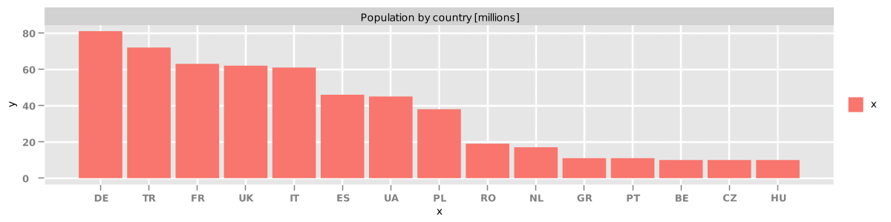

## Scatter

### Scatter chart for sequence of numbers

```scala
val data = Seq(
    (1.0, 1.0),
    (2.0, 4.0),
    (3.0, 9.0)
)

data.plotScatter()
```

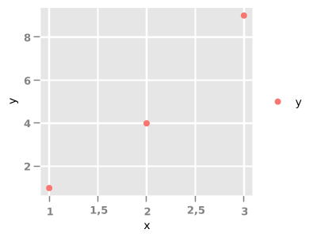

### Scatter chart for sequence of case class

```scala
case class AgeIncome(age: Int, income: Double)

val data = Seq(
    AgeIncome(20, 1000.0),
    AgeIncome(25, 2000.0),
    AgeIncome(30, 2500.0),
    AgeIncome(35, 3000.0),
    AgeIncome(40, 3500.0),
    AgeIncome(45, 3000.0),
    AgeIncome(50, 2500.0)
)

data.plotScatter(_.age, _.income)
```

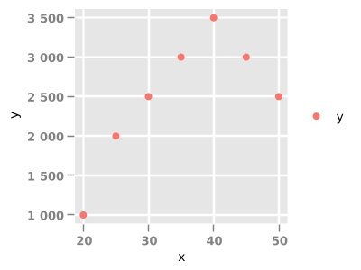

## Line

### Line chart for sequence of numbers

```scala
val data = Seq(
    (1.0, 1.0),
    (2.0, 4.0),
    (3.0, 9.0)
)

data.plotLine()
```

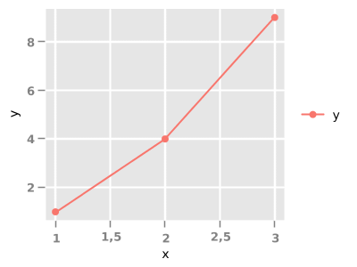

### Line chart for sequence of case class

```scala
case class AgeIncome(age: Int, income: Double)

val data = Seq(
    AgeIncome(20, 1000.0),
    AgeIncome(25, 2000.0),
    AgeIncome(30, 2500.0),
    AgeIncome(35, 3000.0),
    AgeIncome(40, 3500.0),
    AgeIncome(45, 3000.0),
    AgeIncome(50, 2500.0)
)

data.plotLine(_.age, _.income)
```

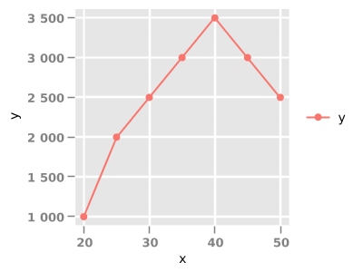

## Histogram

### Histogram for sequence of numbers

```scala
val rand = new Random()
val gaussians = for(i <- 1 to 10000) yield rand.nextGaussian()
gaussians.plotHistogram(100)
```

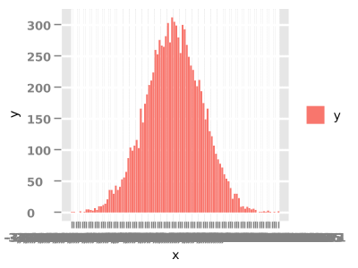

# Multi charts

## Grouping by cols

```scala
people
    .buildPlot()
    .scatter(_.age, _.income)
    .colsBy(_.country)
    .display()
```

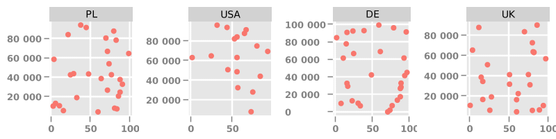

## Grouping by rows

```scala
people
    .buildPlot()
    .scatter(_.age, _.income)
    .rowsBy(_.education)
    .display()
```

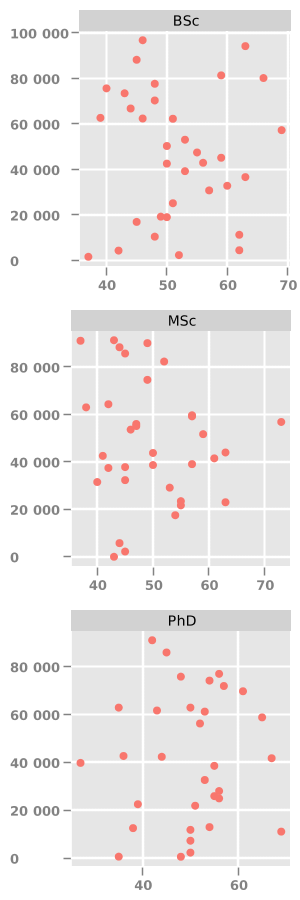

## Grouping by cols and/or rows

### Scatter plot

```scala
people
    .buildPlot()
    .scatter(_.age, _.income)
    .colsBy(_.country)
    .rowsBy(_.education)
    .display()
```

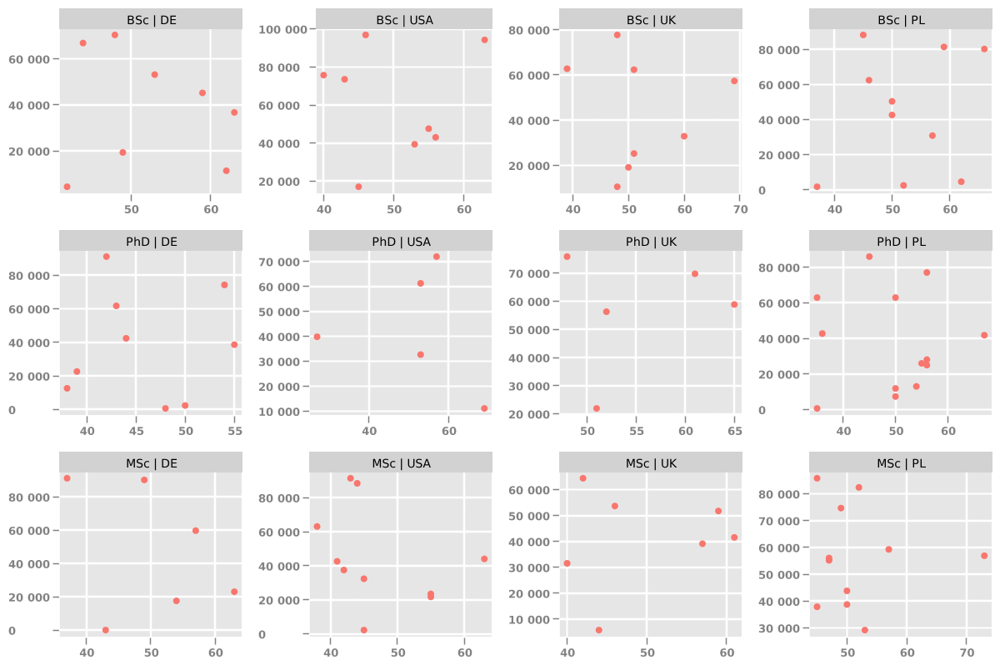

### Bar plot

```scala
val groupedPeopleByCountryEducation = people
    .groupBy(p => (p.country, p.education))
    .mapValues(pv => pv.size)

groupedPeopleByCountryEducation
    .buildPlot()
    .colsBy(_._1._1)
    .bar(x => x._1._2, x => x._2)
    .size(1200, 300)
    .display()
```

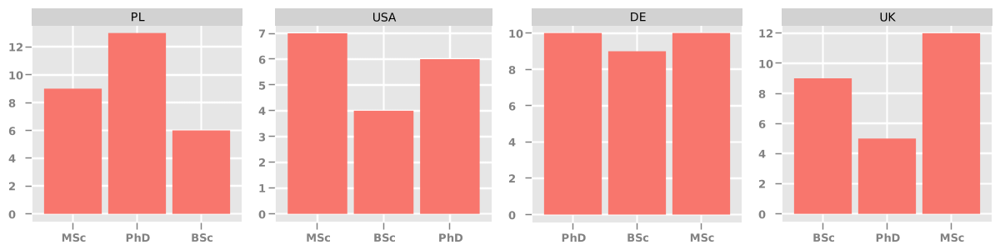

# Saving plot to file

To save plot to file you need to call method *save()* instead of calling *display()*.

```scala
import com.datawizards.splot.model.ImageFormats

Seq(1.0, 4.0, 9.0)
    .buildPlot()
    .bar()
    .save("chart.png", ImageFormats.PNG)
```

Currently supported image formats:

- BMP
- PNG
- JPG
- GIF
- EPS
- PDF
- SVG

# Customizations

## Change chart title

```scala
val data = Seq(1.0, 4.0, 9.0)

data
    .buildPlot()
    .bar()
    .titles("Example bar chart", "x values", "y values")
    .display()
```

## Change chart size (width, height)

```scala
val data = Seq(1.0, 4.0, 9.0)

data
    .buildPlot()
    .bar()
    .size(1600, 1200)
    .display()
```

# Contact

piotr.kalanski@gmail.com
